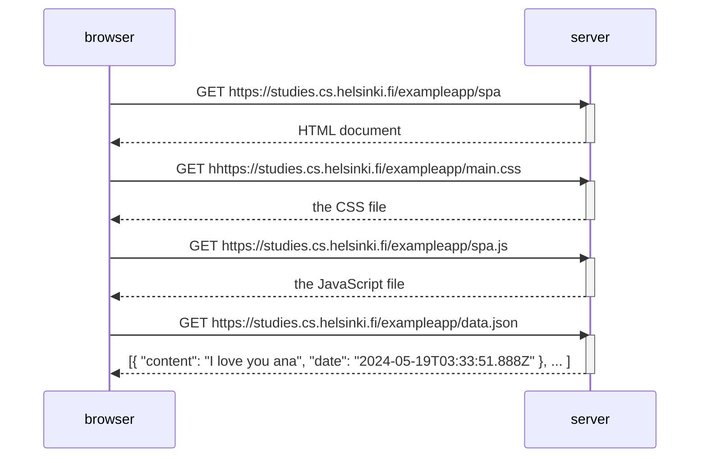

# Exercise 0.5

## Description
This exercise involves creating a simple diagram to illustrate the series of HTTP requests and responses when a goes to https://studies.cs.helsinki.fi/exampleapp/spa 

## Diagram

## Solution

### Step-by-Step Instructions
1. **Inspect the Website**
   - Right-click anywhere on the web page and select "Inspect" from the context menu.
   - This will open the Chrome browser's Developer Tools.

2. **Open the Network Tab**
   - In the Developer Tools, click on the "Network" tab.
   - This tab will show all the network requests made by the browser.
3. **Refresh the website**
   - Go to the specified URL.
3. **Examine the Responses**
   - Look at the network requests that appear in the Network tab.
   - Note down the names and details of the responses, such as their URLs and the payloads.